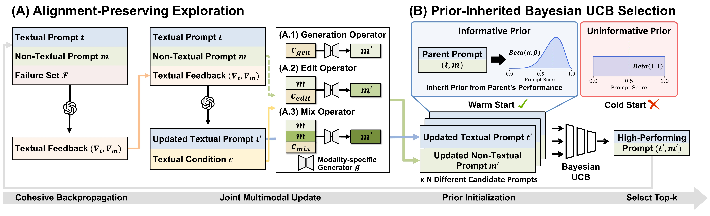

# Multimodal Prompt Optimization: Why Not Leverage Multiple Modalities for MLLMs
[](https://arxiv.org/abs/2510.09201)
[](https://www.python.org/downloads/release/python-310s0/)
[](https://gcc.gnu.org/gcc-9/)

🚀 **Welcome to the official repository of** **Multimodal Prompt Optimization: Why Not Leverage Multiple Modalities for MLLMs**!

## 🔍 Overview

This repository provides the official implementation of Multimodal Prompt Optimizer (MPO), a framework designed to automatically optimize prompts for Multimodal Large Language Models (MLLMs). Unlike traditional text-only approaches, MPO jointly optimizes both textual and non-textual prompts to unlock the full capabilities of MLLMs across a wide range of tasks and domains.


## 📌 Get Started
### Installation
Install dependencies using:
```bash
git clone https://github.com/Dozi01/MPO.git
cd MPO
conda create -n mpo python=3.10 -y
conda activate mpo
pip install -r requirements.txt
```

### MPO: Multimodal Prompt Optimizer
First, activate the vLLM server required for the base model.
```bash
./servers/vllm_server/vllm_activate.sh
```

Next, run the main optimization process using the main.sh script. You can configure all experiment settings, such as model names, tasks, and other parameters, by editing the variables at the top of the `main.sh` file.
```bash
BASE_MODEL='Qwen2.5-VL'
OPTIM_MODEL='gpt-4o-mini'
MM_GENERATOR_MODEL='gpt-image'

OPENAI_API_KEY=YOUR_OPENAI_API_KEY

METHOD=mpo
EXP_NAME=mpo

TASK="cuckoo" # CUB dataset
BUDGET_PER_PROMPT=100

LOG_DIR="./logs/$BASE_MODEL/$OPTIM_MODEL/$MM_GENERATOR_MODEL/${EXP_NAME}/${TASK}"

python main.py \
    --data_dir YOUR_DATASET_PATH \
    --task_name $TASK \
    --log_dir $LOG_DIR \
    --base_model_name $BASE_MODEL \
    --optim_model_name $OPTIM_MODEL \
    --mm_generator_model_name $MM_GENERATOR_MODEL \
    --search_method $METHOD \
    --iteration 13 \
    --beam_width 3 \
    --model_responses_num 3 \
    --seed 42 \
    --budget_per_prompt $BUDGET_PER_PROMPT \
    --evaluation_method bayes-ucb \
    --bayes_prior_strength 10 
```

### Tasks
To add a new task, you'll need to implement a new class that inherits from the BaseTask abstract base class and then register it.

1. Implement the Task Class
First, create a new file in the `src/tasks/` directory. Inside this file, define your new class, making sure it inherits from BaseTask.

2. Register the Task
After creating your class, open the `src/tasks/__init__.py` file. 

## 📜 Citation
If you find this work useful, please cite our paper:
```
@misc{choi2025mpo,
      title={Multimodal Prompt Optimization: Why Not Leverage Multiple Modalities for MLLMs}, 
      author={Yumin Choi and Dongki Kim and Jinheon Baek and Sung Ju Hwang},
      year={2025},
      eprint={2510.09201},
      archivePrefix={arXiv},
      primaryClass={cs.LG},
      url={https://arxiv.org/abs/2510.09201}, 
}
```